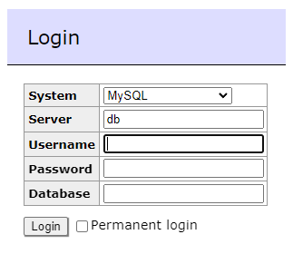

this description is in progress...

### Installation of PostgresSQL via BIBBOX:

After you have decided to install PostgreSQL, you have to fill out the installation form.

Please change the default entries to your needs.

### PostgreSQL as BIBBOX Instance:

After the installation of PostgreSQL as BIBBOX Instance is finished, the following window will occurs:

### Chose the PostgreSQL DB:

Chose the correct PostgreSQL DB as shown in the following figure and enter the login data, which you defined in the installation form.

### Startscreen of PostgreSQL via Adminer:

After the login you will see the following GUI, provided via Adminer:

## After the installation

Have a nice ride with the new Admins youngtimer.

